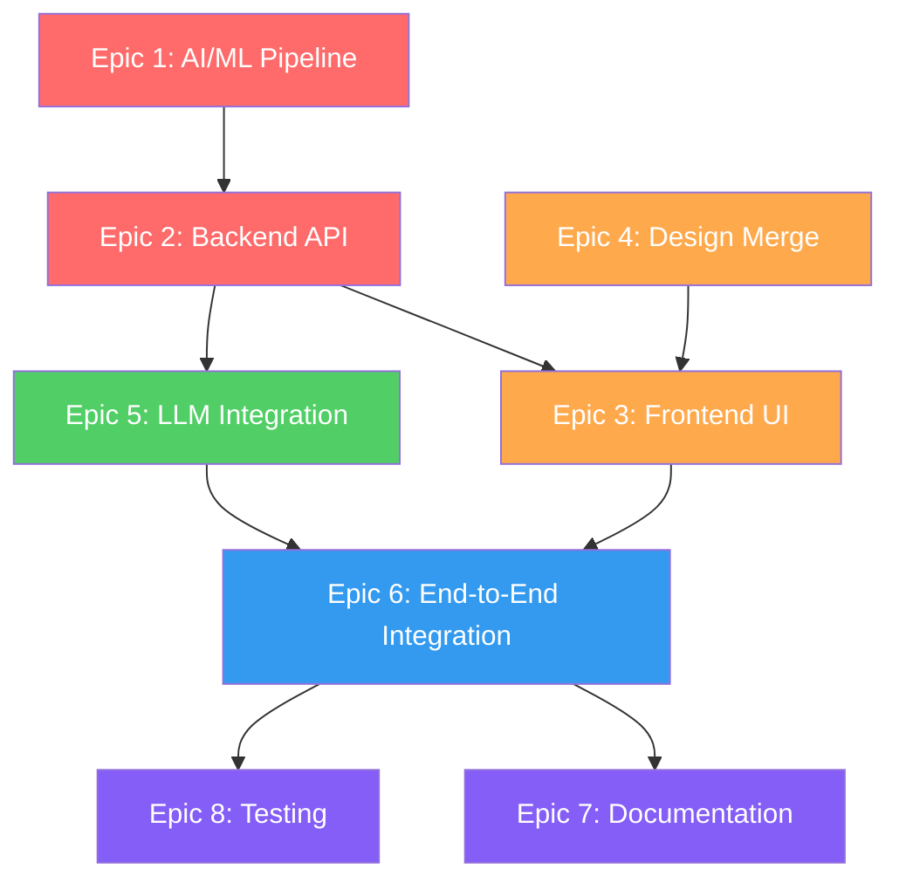

# AI Guidance Counselor — User Stories & Task Breakdown

> **Purpose:** Define every piece of work required to take the project from its current state (~25% complete) to a fully working, documented application that matches the README's promises.

---

## Current State Summary

| Area | Status | What Exists |
|---|---|---|
| **Auth (backend + frontend)** | ✅ Complete | JWT register/login/refresh/logout, admin CRUD, protected routes |
| **AI/ML** | 🟡 Prototype | 2 Jupyter notebooks (training + demo), saved XGBoost model + LabelEncoder (`.h5` via joblib), no `.py` files, no model comparisons |
| **Assessment flow** | ❌ Not started | No API endpoint, no data model. Static UI mockup exists in `frontendpreview/` only |
| **Career results** | ❌ Not started | No prediction endpoint. Static UI mockup exists in `frontendpreview/` only |
| **LLM summary** | ❌ Not started | Documented idea only |
| **UI/Design** | 🟡 Split | `frontendpreview/` has **full polished UI** (8 pages, 15 components, design system) but no API wiring; `client/` has working auth but minimal design |
| **Documentation** | 🟡 READMEs only | No UML, no architecture docs, no API docs |

### Key Assets Already Available

| Asset | Path | Notes |
|---|---|---|
| Trained XGBoost model | `ai/models/career_prediction_model.h5` (7.48 MB) | Serialized via joblib, ready to load |
| Label encoder | `ai/models/career_label_encoder.h5` (1.8 KB) | Needed to decode numeric predictions → profession names |
| Training notebook | `ai/initial_model_training.ipynb` | Full pipeline; exports model to `ai/models/` |
| Prediction demo notebook | `ai/python_demo_of_model_application.ipynb` | Shows how to load model and run predictions |
| Complete UI mockup | `frontendpreview/` | 8 pages (Home, Login, Register, Dashboard, Assessment, Results, Profile, AdminUsers), 15 components, 3 mock data services |

> [!WARNING]
> **README discrepancy:** Both READMEs reference `dataset_exploration.ipynb`, but the actual notebook is named `initial_model_training.ipynb`. This needs to be fixed.

---

## Epic 1 — AI/ML Production Pipeline

### US-1.1: Model Training Script (Production-Ready)

> *As a developer, I want a standalone Python training script so that the model can be retrained reproducibly without a Jupyter notebook.*

> [!NOTE]
> A trained model already exists at `ai/models/career_prediction_model.h5` and the training logic is in `initial_model_training.ipynb`. This story is about extracting that into production `.py` files.

**Acceptance Criteria:**
- [ ] A `train.py` script in `ai/src/` that loads the dataset, preprocesses it, trains the model, and saves it to `ai/models/`
- [ ] Uses argument parsing (e.g., `argparse`) for hyperparameters (learning rate, max depth, n_estimators, test size, random seed)
- [ ] Outputs training metrics (accuracy, Top-5 accuracy) to console and to a `results/` folder as JSON
- [ ] Saves the trained model in a portable format (`.joblib` or `.json`)
- [ ] Saves the fitted `LabelEncoder` and `MinMaxScaler` alongside the model so inference can decode predictions
- [ ] Includes a `requirements.txt` with pinned versions

**Tasks:**
- [ ] T-1.1.1: Create `ai/src/` directory structure (`data/`, `models/`, `results/`, `src/`)
- [ ] T-1.1.2: Extract data loading & preprocessing from notebook into `ai/src/preprocessing.py`
- [ ] T-1.1.3: Extract model training logic into `ai/src/train.py` with argparse
- [ ] T-1.1.4: Implement model + scaler + encoder serialization (joblib)
- [ ] T-1.1.5: Add console + JSON output for training metrics
- [ ] T-1.1.6: Create `ai/requirements.txt` with pinned dependencies
- [ ] T-1.1.7: Verify end-to-end: `python src/train.py` produces a working saved model

---

### US-1.2: Model Comparison & Architecture Evaluation

> *As a researcher, I want to compare multiple ML architectures on the same dataset so that I can justify the final model choice with empirical evidence.*

**Acceptance Criteria:**
- [ ] A `compare_models.py` script that trains and evaluates at least 4 different classifiers on the same train/test split
- [ ] Models to compare: XGBoost, Random Forest, SVM (with RBF kernel), K-Nearest Neighbors, and optionally a simple Neural Network (sklearn MLPClassifier or PyTorch)
- [ ] For each model, records: Top-1 accuracy, Top-5 accuracy, training time, inference time, and accuracy under noise (σ=0.06)
- [ ] Outputs a comparison table as CSV and a summary markdown file
- [ ] Generates comparison visualizations (bar charts) saved as PNG images

**Tasks:**
- [ ] T-1.2.1: Create `ai/src/compare_models.py` with a model registry pattern
- [ ] T-1.2.2: Implement each classifier with appropriate hyperparameter grids
- [ ] T-1.2.3: Implement shared evaluation function (Top-1, Top-5, noise robustness, timing)
- [ ] T-1.2.4: Generate comparison table (CSV) and summary (markdown)
- [ ] T-1.2.5: Generate bar chart visualizations using matplotlib
- [ ] T-1.2.6: Document findings and justify XGBoost selection (or change if another wins)

---

### US-1.3: Inference Module

> *As a backend developer, I want a Python inference module that accepts 8 intelligence scores and returns Top-5 career predictions with confidence scores, so the backend can call it.*

> [!NOTE]
> `python_demo_of_model_application.ipynb` already contains working prediction logic including model loading, score normalization (1-5 → 0-1 scale), and Top-5 extraction via `predict_proba`. Extract and refactor this into a clean module.

**Acceptance Criteria:**
- [ ] A `predict.py` module with a `predict(scores: list[float]) -> list[dict]` function
- [ ] Loads the saved model, scaler, and encoder from `ai/models/`
- [ ] Accepts raw (unnormalized) scores, normalizes them internally, and returns Top-5 predictions with profession names and confidence percentages
- [ ] Has proper error handling (invalid input length, missing model files, out-of-range scores)
- [ ] Can be imported as a module or run standalone for testing: `python predict.py --scores 11,5,12,16,17,11,18,19`

**Tasks:**
- [ ] T-1.3.1: Create `ai/src/predict.py` with model/scaler/encoder loading
- [ ] T-1.3.2: Implement `predict()` function with normalization + Top-5 extraction
- [ ] T-1.3.3: Add input validation and error handling
- [ ] T-1.3.4: Add CLI mode for standalone testing
- [ ] T-1.3.5: Write unit tests for the prediction module (`ai/tests/test_predict.py`)

---

### US-1.4: AI Microservice (Flask/FastAPI)

> *As a backend developer, I want the AI model served via a lightweight HTTP API so the Node.js backend can call it without embedding Python.*

**Acceptance Criteria:**
- [ ] A `server.py` (FastAPI or Flask) in `ai/` that exposes `POST /predict` endpoint
- [ ] Accepts JSON body: `{ "scores": { "linguistic": 11, "musical": 5, ... } }`
- [ ] Returns JSON: `{ "predictions": [{ "profession": "...", "confidence": 0.95 }, ...] }`
- [ ] Loads model once at startup (not per-request)
- [ ] Includes input validation (8 scores required, numeric, within valid range)
- [ ] Health check endpoint: `GET /health`
- [ ] Configurable port via environment variable

**Tasks:**
- [ ] T-1.4.1: Set up FastAPI/Flask app structure in `ai/src/server.py`
- [ ] T-1.4.2: Create prediction endpoint with request/response schemas
- [ ] T-1.4.3: Integrate the `predict.py` module
- [ ] T-1.4.4: Add input validation and error responses
- [ ] T-1.4.5: Add health check endpoint
- [ ] T-1.4.6: Add CORS configuration for the Node.js backend
- [ ] T-1.4.7: Update `ai/requirements.txt` with server dependencies
- [ ] T-1.4.8: Test end-to-end with curl/Postman

---

## Epic 2 — Backend: Assessment & Prediction API

### US-2.1: Assessment Data Model

> *As a developer, I want a Mongoose schema for student assessments so that intelligence scores can be stored and retrieved.*

**Acceptance Criteria:**
- [ ] `Assessment` model with fields: `userId` (ref User), the 8 intelligence scores (Number, required, min/max validated), `createdAt` timestamp
- [ ] Indexed by `userId` for efficient lookup
- [ ] Validation rules: all scores must be numbers within the dataset's valid range

**Tasks:**
- [ ] T-2.1.1: Create `server/src/models/Assessment.js` with Mongoose schema
- [ ] T-2.1.2: Add field-level validation (type, required, min, max)
- [ ] T-2.1.3: Add compound index on `userId` + `createdAt`

---

### US-2.2: Prediction Result Data Model

> *As a developer, I want a Mongoose schema for prediction results so that career recommendations are persisted and can be reviewed later.*

**Acceptance Criteria:**
- [ ] `PredictionResult` model with: `assessmentId` (ref Assessment), `userId` (ref User), `predictions` array (profession name, confidence, rank), optional `llmSummary` (String), `createdAt`
- [ ] One-to-one relationship with Assessment

**Tasks:**
- [ ] T-2.2.1: Create `server/src/models/PredictionResult.js`
- [ ] T-2.2.2: Define the predictions sub-document schema
- [ ] T-2.2.3: Add indexes for efficient queries

---

### US-2.3: Assessment API Endpoints

> *As a student, I want to submit my intelligence scores and retrieve my past assessments via the API.*

**Acceptance Criteria:**
- [ ] `POST /api/assessments` — Submit a new assessment (auth required)
- [ ] `GET /api/assessments` — Get all assessments for the authenticated user
- [ ] `GET /api/assessments/:id` — Get a specific assessment (owned by user or admin)
- [ ] `DELETE /api/assessments/:id` — Delete an assessment (owned by user or admin)
- [ ] Input validation on all 8 score fields
- [ ] Follows existing layered architecture (route → controller → service → repository)

**Tasks:**
- [ ] T-2.3.1: Create `server/src/repositories/assessmentRepository.js`
- [ ] T-2.3.2: Create `server/src/services/assessmentService.js`
- [ ] T-2.3.3: Create `server/src/controllers/assessmentController.js`
- [ ] T-2.3.4: Create `server/src/validators/assessmentValidator.js`
- [ ] T-2.3.5: Create `server/src/routes/assessmentRoutes.js`
- [ ] T-2.3.6: Register routes in `server/src/routes/index.js`
- [ ] T-2.3.7: Test all endpoints with Postman/curl

---

### US-2.4: Prediction API Endpoint

> *As a student, I want to trigger a career prediction from my assessment scores and receive Top-5 career recommendations.*

**Acceptance Criteria:**
- [ ] `POST /api/predictions` — Takes an `assessmentId`, calls the AI microservice, stores and returns results
- [ ] `GET /api/predictions/:assessmentId` — Retrieve stored predictions for an assessment
- [ ] `GET /api/predictions` — Get all prediction results for the authenticated user
- [ ] The backend proxies to the AI microservice (`POST http://ai-service:port/predict`)
- [ ] Handles AI service errors gracefully (timeout, unavailable, invalid response)
- [ ] Stores the prediction result in MongoDB

**Tasks:**
- [ ] T-2.4.1: Create `server/src/repositories/predictionRepository.js`
- [ ] T-2.4.2: Create `server/src/services/predictionService.js` with AI microservice HTTP client
- [ ] T-2.4.3: Create `server/src/controllers/predictionController.js`
- [ ] T-2.4.4: Create `server/src/routes/predictionRoutes.js`
- [ ] T-2.4.5: Add AI service URL to `server/src/config/index.js` and `.env.example`
- [ ] T-2.4.6: Register routes in `server/src/routes/index.js`
- [ ] T-2.4.7: Add error handling for AI service unavailability

---

### US-2.5: LLM Summary Endpoint

> *As a student, I want to generate a personalized career summary from my prediction results so that I understand what my results mean.*

**Acceptance Criteria:**
- [ ] `POST /api/summaries/:predictionId` — Generates an LLM summary for a prediction result
- [ ] `GET /api/summaries/:predictionId` — Retrieves a stored summary
- [ ] Constructs an LLM prompt from the prediction data + student's intelligence profile
- [ ] Supports both open-source (Ollama/local) and API-controlled (OpenAI/Gemini) LLMs via config
- [ ] Stores the generated summary in the PredictionResult document
- [ ] Rate-limited to prevent abuse

**Tasks:**
- [ ] T-2.5.1: Create `server/src/services/llmService.js` with provider abstraction
- [ ] T-2.5.2: Implement OpenAI/Gemini API provider
- [ ] T-2.5.3: Implement Ollama/local model provider
- [ ] T-2.5.4: Create prompt template with student profile + predictions context
- [ ] T-2.5.5: Create `server/src/controllers/summaryController.js`
- [ ] T-2.5.6: Create `server/src/routes/summaryRoutes.js`
- [ ] T-2.5.7: Add LLM provider config to `.env.example` and config
- [ ] T-2.5.8: Add rate limiting middleware

---

## Epic 3 — Frontend: Assessment & Results UI

### US-3.1: Assessment Page

> *As a recently graduated student, I want to rate myself across 8 intelligence dimensions using an intuitive interface so that I can discover career paths that match my strengths.*

**Acceptance Criteria:**
- [ ] Protected route at `/assessment`
- [ ] Displays all 8 intelligence dimensions with clear labels and descriptions
- [ ] Each dimension has a slider or numeric input (appropriate range)
- [ ] Shows a real-time radar/spider chart of the student's current scores
- [ ] Has a progress indicator (e.g., "5 of 8 dimensions rated")
- [ ] Submit button calls `POST /api/assessments` then triggers `POST /api/predictions`
- [ ] Disables submit until all 8 dimensions are filled
- [ ] Shows loading state during submission
- [ ] On success, redirects to the results page

**Tasks:**
- [ ] T-3.1.1: Create `client/src/pages/Assessment.jsx` page component
- [ ] T-3.1.2: Build intelligence dimension slider/input components
- [ ] T-3.1.3: Implement radar chart visualization (Chart.js or Recharts)
- [ ] T-3.1.4: Add progress indicator
- [ ] T-3.1.5: Create `client/src/services/assessmentService.js` API integration
- [ ] T-3.1.6: Wire form submission → API → redirect to results
- [ ] T-3.1.7: Add route to `App.jsx` (protected)
- [ ] T-3.1.8: Add input validation and error states

---

### US-3.2: Results Page

> *As a student, I want to see my Top-5 career recommendations with confidence scores and explanations so that I can understand my options.*

**Acceptance Criteria:**
- [ ] Protected route at `/results/:predictionId`
- [ ] Displays ranked Top-5 careers with profession name, confidence percentage, and rank badge
- [ ] Shows the student's intelligence profile as a radar chart
- [ ] Includes the LLM-generated summary (if available), with a "Generate Summary" button if not
- [ ] Has a "Retake Assessment" button
- [ ] Has a "Share Report" / "Download PDF" option
- [ ] Loading states for prediction and summary generation

**Tasks:**
- [ ] T-3.2.1: Create `client/src/pages/Results.jsx` page component
- [ ] T-3.2.2: Build career card component with rank, name, and confidence bar
- [ ] T-3.2.3: Integrate radar chart for intelligence profile
- [ ] T-3.2.4: Build LLM summary display section with generate button
- [ ] T-3.2.5: Create `client/src/services/predictionService.js`
- [ ] T-3.2.6: Create `client/src/services/summaryService.js`
- [ ] T-3.2.7: Add route to `App.jsx` (protected)
- [ ] T-3.2.8: Add loading/error states

---

### US-3.3: Functional Dashboard

> *As a student, I want a dashboard that shows my assessment history and past career recommendations so that I can track how my profile evolves.*

**Acceptance Criteria:**
- [ ] Dashboard at `/dashboard` shows: welcome message, most recent assessment summary, assessment history list, quick "Start Assessment" CTA
- [ ] Each history entry shows date, top prediction, and a link to full results
- [ ] Empty state if no assessments yet (CTA to take first assessment)
- [ ] Fetches data from `GET /api/assessments` and `GET /api/predictions`

**Tasks:**
- [ ] T-3.3.1: Redesign `client/src/pages/Dashboard.jsx` with real data fetching
- [ ] T-3.3.2: Build assessment history list component
- [ ] T-3.3.3: Build recent result summary card
- [ ] T-3.3.4: Implement empty state with CTA
- [ ] T-3.3.5: Wire API calls for assessments and predictions

---

### US-3.4: Navigation & Layout

> *As a user, I want consistent navigation across all pages so that I can move between sections easily.*

**Acceptance Criteria:**
- [ ] Persistent navbar with brand name, navigation links (Home, Dashboard, Assessment), and user menu (profile, logout)
- [ ] Navbar adapts: shows Login/Register when unauthenticated, Dashboard/Assessment when authenticated
- [ ] Footer with project info
- [ ] Responsive layout (mobile hamburger menu)

**Tasks:**
- [ ] T-3.4.1: Create `client/src/components/Navbar.jsx`
- [ ] T-3.4.2: Create `client/src/components/Footer.jsx`
- [ ] T-3.4.3: Create `client/src/components/Layout.jsx` wrapper
- [ ] T-3.4.4: Implement responsive mobile menu
- [ ] T-3.4.5: Add auth-conditional rendering (login/register vs dashboard/assessment)
- [ ] T-3.4.6: Integrate Layout into `App.jsx` route structure

---

## Epic 4 — Frontend: Design System & Preview Merge

### US-4.1: Merge Frontend Preview Design into Client

> *As a developer, I want to adopt the polished design system from `frontendpreview/` into the working `client/` app so that the product looks professional.*

**Acceptance Criteria:**
- [ ] The `client/` app uses the design system from `frontendpreview/` (brand colors, card styles, typography, button styles)
- [ ] `index.css` in `client/` includes all custom CSS from `frontendpreview/`
- [ ] Reusable components from `frontendpreview/` (Button, Input, SectionTitle, FeatureCard) are ported to `client/src/components/`
- [ ] Home page in `client/` matches the polished `frontendpreview/` Home (hero, features, how-it-works, CTA)
- [ ] Login and Register pages adopt the split-panel design from `frontendpreview/`
- [ ] All pages use the Inter font and brand color palette

> [!TIP]
> The `frontendpreview/` contains **15 ready-made components** (Navbar, Footer, HeroSection, SectionTitle, FeatureCard, Button, Input, DashboardSidebar, DashboardStats, IntelligenceCard, CareerCard, SummaryCard, ProfileCard, RecommendationList, AssessmentSlider) and **8 pages** (Home, Login, Register, Dashboard, Assessment, Results, Profile, AdminUsers) with **3 mock data services** (careerRecommendations, intelligenceScores, users). These just need to be ported and wired to real API calls.

**Tasks:**
- [ ] T-4.1.1: Port `frontendpreview/src/index.css` design tokens and custom styles to `client/src/index.css`
- [ ] T-4.1.2: Port all 15 reusable components from `frontendpreview/src/components/` to `client/src/components/`
- [ ] T-4.1.3: Port `client/src/pages/Home.jsx` using the `frontendpreview/` Home design (hero, features, how-it-works, CTA)
- [ ] T-4.1.4: Port `client/src/pages/Login.jsx` with split-panel layout — wire to existing `authService`
- [ ] T-4.1.5: Port `client/src/pages/Register.jsx` with split-panel layout — wire to existing `authService`
- [ ] T-4.1.6: Port `client/src/pages/Dashboard.jsx` with sidebar, stats, intelligence summary, career cards
- [ ] T-4.1.7: Port `client/src/pages/Assessment.jsx` with slider cards for 8 dimensions
- [ ] T-4.1.8: Port `client/src/pages/Results.jsx` with intelligence profile, Top-5 matches, summary
- [ ] T-4.1.9: Port `client/src/pages/Profile.jsx` with profile card, strengths, saved recommendations
- [ ] T-4.1.10: Update `tailwind.config.js` to match preview's config (brand colors, fonts)
- [ ] T-4.1.11: Replace mock data services with real API service calls
- [ ] T-4.1.12: Verify all pages render correctly on mobile and desktop
- [ ] T-4.1.13: Remove or archive the `frontendpreview/` directory once merged

---

### US-4.2: Auth Context & State Management

> *As a developer, I want centralized auth state management so that all components can reliably check the user's authentication status.*

**Acceptance Criteria:**
- [ ] React Context for auth state (user, tokens, isAuthenticated, isLoading)
- [ ] `useAuth()` custom hook for consuming auth context
- [ ] Auth context handles login, logout, token refresh, and initial session restoration
- [ ] `ProtectedRoute` uses context instead of raw localStorage checks
- [ ] Navbar uses context to conditionally render auth/unauth navigation

**Tasks:**
- [ ] T-4.2.1: Create `client/src/context/AuthContext.jsx`
- [ ] T-4.2.2: Create `client/src/hooks/useAuth.js`
- [ ] T-4.2.3: Wrap App in AuthProvider
- [ ] T-4.2.4: Refactor `ProtectedRoute.jsx` to use context
- [ ] T-4.2.5: Refactor Navbar to use context
- [ ] T-4.2.6: Remove direct localStorage access from pages

---

## Epic 5 — LLM Integration

### US-5.1: LLM Provider Implementation

> *As a developer, I want a pluggable LLM service that can switch between open-source and API-controlled models via config.*

**Acceptance Criteria:**
- [ ] Abstract `LLMProvider` interface with `generateSummary(context)` method
- [ ] `OpenAIProvider` implementation (GPT-4/3.5)
- [ ] `OllamaProvider` implementation (local open-source models)
- [ ] Provider selected via `LLM_PROVIDER` environment variable
- [ ] Prompt template includes: student's 8 scores, Top-5 predictions with confidence, and instructions for actionable guidance
- [ ] Response includes: why each career fits, next steps, cross-career connections

**Tasks:**
- [ ] T-5.1.1: Design prompt template
- [ ] T-5.1.2: Implement provider abstraction in `server/src/services/llmService.js`
- [ ] T-5.1.3: Implement OpenAI provider
- [ ] T-5.1.4: Implement Ollama/local provider
- [ ] T-5.1.5: Add config entries to `.env.example`
- [ ] T-5.1.6: Test with both providers

---

### US-5.2: LLM Summary UI

> *As a student, I want to see a personalized narrative summary that explains my career matches in plain language.*

**Acceptance Criteria:**
- [ ] Summary section on the Results page with formatted markdown rendering
- [ ] "Generate Summary" button if no summary exists yet
- [ ] Loading spinner with "Generating your personalized summary..." message during LLM call
- [ ] Summary renders with proper formatting (paragraphs, bold, bullet points)
- [ ] Error state if LLM service is unavailable

**Tasks:**
- [ ] T-5.2.1: Build summary display component with markdown rendering
- [ ] T-5.2.2: Add generate button with loading state
- [ ] T-5.2.3: Wire to `POST /api/summaries/:predictionId` endpoint
- [ ] T-5.2.4: Handle error states gracefully

---

## Epic 6 — End-to-End Integration

### US-6.1: Full Assessment-to-Results Flow

> *As a student, I want to complete an assessment and immediately see my career recommendations in one seamless flow.*

**Acceptance Criteria:**
- [ ] Student logs in → navigates to Assessment → fills 8 dimensions → submits → sees loading → lands on Results page with Top-5 careers
- [ ] Assessment is saved in MongoDB
- [ ] Prediction result is saved in MongoDB
- [ ] Results page shows the radar chart + career list
- [ ] Student can navigate back to Dashboard and see the assessment in history
- [ ] Entire flow works without errors

**Tasks:**
- [ ] T-6.1.1: Integration test: frontend → backend → AI service → response → display
- [ ] T-6.1.2: Verify data persistence (assessment + prediction in MongoDB)
- [ ] T-6.1.3: Verify error handling when AI service is down
- [ ] T-6.1.4: Test with multiple users and multiple assessments
- [ ] T-6.1.5: Performance testing (response time for prediction)

---

### US-6.2: Multi-Service Startup

> *As a developer, I want a simple way to start all three services (frontend, backend, AI) together for local development.*

**Acceptance Criteria:**
- [ ] Root-level `package.json` with `npm run dev` that starts all 3 services concurrently
- [ ] Or a `docker-compose.yml` that spins up all 3 services
- [ ] Documentation in README for both approaches

**Tasks:**
- [ ] T-6.2.1: Create root `package.json` with `concurrently` scripts
- [ ] T-6.2.2: (Optional) Create `docker-compose.yml` for containerized setup
- [ ] T-6.2.3: Update README with startup instructions for all 3 services

---

## Epic 7 — Documentation & UML

### US-7.1: System Architecture Document

> *As an academic reviewer, I want a system architecture document with diagrams so that I can understand the overall design.*

**Acceptance Criteria:**
- [ ] Architecture overview document (`docs/architecture.md`)
- [ ] **System Context Diagram** (C4 Level 1) — showing external actors (Student, Admin, LLM API) and the system boundary
- [ ] **Container Diagram** (C4 Level 2) — showing React client, Express API, Python AI service, MongoDB, LLM provider
- [ ] **Technology stack table** with justifications
- [ ] Data flow narrative for the core assessment → prediction → summary flow

**Tasks:**
- [ ] T-7.1.1: Create `docs/` directory
- [ ] T-7.1.2: Write system context diagram (Mermaid)
- [ ] T-7.1.3: Write container diagram (Mermaid)
- [ ] T-7.1.4: Write architecture narrative and technology justifications
- [ ] T-7.1.5: Create data flow diagram for the assessment pipeline

---

### US-7.2: UML Class Diagrams

> *As an academic reviewer, I want UML class diagrams for both the backend and AI module so that I can see the object model.*

**Acceptance Criteria:**
- [ ] **Backend class diagram** showing: Models (User, Assessment, PredictionResult), Services, Repositories, Controllers, and their relationships
- [ ] **AI module class diagram** showing: Preprocessor, ModelTrainer, Predictor, ModelServer, and their relationships
- [ ] Diagrams rendered with Mermaid or PlantUML
- [ ] Saved in `docs/diagrams/`

**Tasks:**
- [ ] T-7.2.1: Create backend class diagram (`docs/diagrams/backend_class_diagram.md`)
- [ ] T-7.2.2: Create AI module class diagram (`docs/diagrams/ai_class_diagram.md`)
- [ ] T-7.2.3: Review for accuracy against actual code

---

### US-7.3: UML Sequence Diagrams

> *As an academic reviewer, I want UML sequence diagrams for the key user flows so that I can trace the interaction between components.*

**Acceptance Criteria:**
- [ ] **Registration & Login flow** — Client ↔ Express ↔ MongoDB ↔ JWT
- [ ] **Assessment submission flow** — Client → Express → MongoDB → AI Service → MongoDB → Client
- [ ] **LLM summary generation flow** — Client → Express → LLM API → MongoDB → Client
- [ ] **Token refresh flow** — Client → Express → JWT verification → new token

**Tasks:**
- [ ] T-7.3.1: Create registration/login sequence diagram
- [ ] T-7.3.2: Create assessment + prediction sequence diagram
- [ ] T-7.3.3: Create LLM summary sequence diagram
- [ ] T-7.3.4: Create token refresh sequence diagram

---

### US-7.4: Use Case Diagram

> *As an academic reviewer, I want a UML use case diagram showing all actors and their interactions with the system.*

**Acceptance Criteria:**
- [ ] Actors: Student, Admin, LLM Service (external)
- [ ] Student use cases: Register, Login, Take Assessment, View Results, Generate Summary, View Assessment History, Logout
- [ ] Admin use cases: Manage Users, View All Assessments
- [ ] System boundary clearly defined

**Tasks:**
- [ ] T-7.4.1: Create use case diagram (`docs/diagrams/use_case_diagram.md`)

---

### US-7.5: Entity-Relationship Diagram

> *As an academic reviewer, I want an ER diagram showing the database schema and relationships.*

**Acceptance Criteria:**
- [ ] Shows all MongoDB collections: Users, Assessments, PredictionResults
- [ ] Shows relationships (User 1→N Assessments, Assessment 1→1 PredictionResult)
- [ ] Shows all fields with types
- [ ] Notes on indexes

**Tasks:**
- [ ] T-7.5.1: Create ER diagram (`docs/diagrams/er_diagram.md`)

---

### US-7.6: API Documentation

> *As a developer, I want comprehensive API documentation so that frontend and backend developers can work independently.*

**Acceptance Criteria:**
- [ ] Full API reference (`docs/api.md`) with all endpoints
- [ ] For each endpoint: method, path, auth requirements, request body schema, response schema, error codes, example request/response
- [ ] Covers: Auth, Users, Assessments, Predictions, Summaries, Health

**Tasks:**
- [ ] T-7.6.1: Document auth endpoints
- [ ] T-7.6.2: Document user endpoints
- [ ] T-7.6.3: Document assessment endpoints
- [ ] T-7.6.4: Document prediction endpoints
- [ ] T-7.6.5: Document summary endpoints
- [ ] T-7.6.6: Add example request/response for each

---

### US-7.7: AI Model Documentation

> *As an academic reviewer, I want documentation of the ML methodology, model comparisons, and performance metrics.*

**Acceptance Criteria:**
- [ ] AI methodology document (`docs/ai_methodology.md`)
- [ ] Dataset description with statistical summary
- [ ] Preprocessing pipeline explanation with rationale
- [ ] Model comparison table with all metrics
- [ ] Hyperparameter tuning details
- [ ] Robustness analysis with noise testing methodology
- [ ] Feature importance analysis
- [ ] Final model justification
- [ ] Embedded charts and visualizations

**Tasks:**
- [ ] T-7.7.1: Write dataset section with statistics
- [ ] T-7.7.2: Write preprocessing methodology
- [ ] T-7.7.3: Write model comparison analysis (from US-1.2 output)
- [ ] T-7.7.4: Write robustness analysis
- [ ] T-7.7.5: Generate and embed feature importance charts
- [ ] T-7.7.6: Write final model selection justification

---

### US-7.8: Deployment Diagram

> *As an academic reviewer, I want a deployment diagram showing how the system components are deployed.*

**Acceptance Criteria:**
- [ ] UML deployment diagram showing: Client (browser), Express server (Node.js), AI service (Python), MongoDB, LLM API (external)
- [ ] Shows communication protocols (HTTP/HTTPS, MongoDB protocol)
- [ ] Shows ports and network boundaries

**Tasks:**
- [ ] T-7.8.1: Create deployment diagram (`docs/diagrams/deployment_diagram.md`)

---

## Epic 8 — Testing & Quality Assurance

### US-8.1: Backend Unit Tests

> *As a developer, I want unit tests for the backend services so that I can refactor confidently.*

**Acceptance Criteria:**
- [ ] Tests for auth service (register, login, refresh, logout)
- [ ] Tests for assessment service (create, get, list, delete)
- [ ] Tests for prediction service (create prediction, handle AI service errors)
- [ ] Test coverage reported
- [ ] Tests run via `npm test`

**Tasks:**
- [ ] T-8.1.1: Set up Jest or Vitest in server
- [ ] T-8.1.2: Write auth service tests
- [ ] T-8.1.3: Write assessment service tests
- [ ] T-8.1.4: Write prediction service tests
- [ ] T-8.1.5: Add `test` script to `server/package.json`

---

### US-8.2: AI Module Tests

> *As a developer, I want tests for the AI prediction module to ensure correctness.*

**Acceptance Criteria:**
- [ ] Tests for preprocessing (normalization, encoding)
- [ ] Tests for prediction function (valid input, invalid input, edge cases)
- [ ] Tests for model loading
- [ ] Tests run via `pytest`

**Tasks:**
- [ ] T-8.2.1: Create `ai/tests/` directory
- [ ] T-8.2.2: Write preprocessing tests
- [ ] T-8.2.3: Write prediction tests
- [ ] T-8.2.4: Write model loading tests
- [ ] T-8.2.5: Add pytest to requirements.txt

---

### US-8.3: Frontend Component Tests

> *As a developer, I want basic component tests for critical UI components.*

**Acceptance Criteria:**
- [ ] Tests for Assessment form (renders all 8 inputs, validates before submit)
- [ ] Tests for Results page (renders Top-5 cards, shows radar chart)
- [ ] Tests for ProtectedRoute (redirects when unauthenticated)

**Tasks:**
- [ ] T-8.3.1: Set up Vitest + React Testing Library in client
- [ ] T-8.3.2: Write Assessment form tests
- [ ] T-8.3.3: Write Results page tests
- [ ] T-8.3.4: Write ProtectedRoute tests

---

## Priority & Dependency Matrix

> 🔴 = Critical Path &nbsp; 🟠 = High Priority &nbsp; 🟢 = Medium &nbsp; 🔵 = Integration &nbsp; 🟣 = Final Phase

---

## Suggested Sprint Plan

| Sprint | Duration | Epics | Goal |
|---|---|---|---|
| **Sprint 1** | 1 week | Epic 1 (US-1.1, 1.2, 1.3, 1.4) | AI pipeline complete: training scripts, model comparison, inference module, microservice |
| **Sprint 2** | 1 week | Epic 2 (US-2.1–2.4), Epic 4 (US-4.1, 4.2) | Backend API for assessments/predictions + design system merge |
| **Sprint 3** | 1 week | Epic 3 (US-3.1–3.4) | Frontend assessment, results, dashboard, and navigation |
| **Sprint 4** | 1 week | Epic 5, Epic 6 | LLM integration + end-to-end flow verification |
| **Sprint 5** | 1 week | Epic 7, Epic 8 | Documentation (all UML diagrams, API docs) + testing |

---

## Total Metrics

| Metric | Count |
|---|---|
| **Epics** | 8 |
| **User Stories** | 21 |
| **Tasks** | ~110 |
| **Estimated Effort** | 4–5 weeks (1 developer) |
