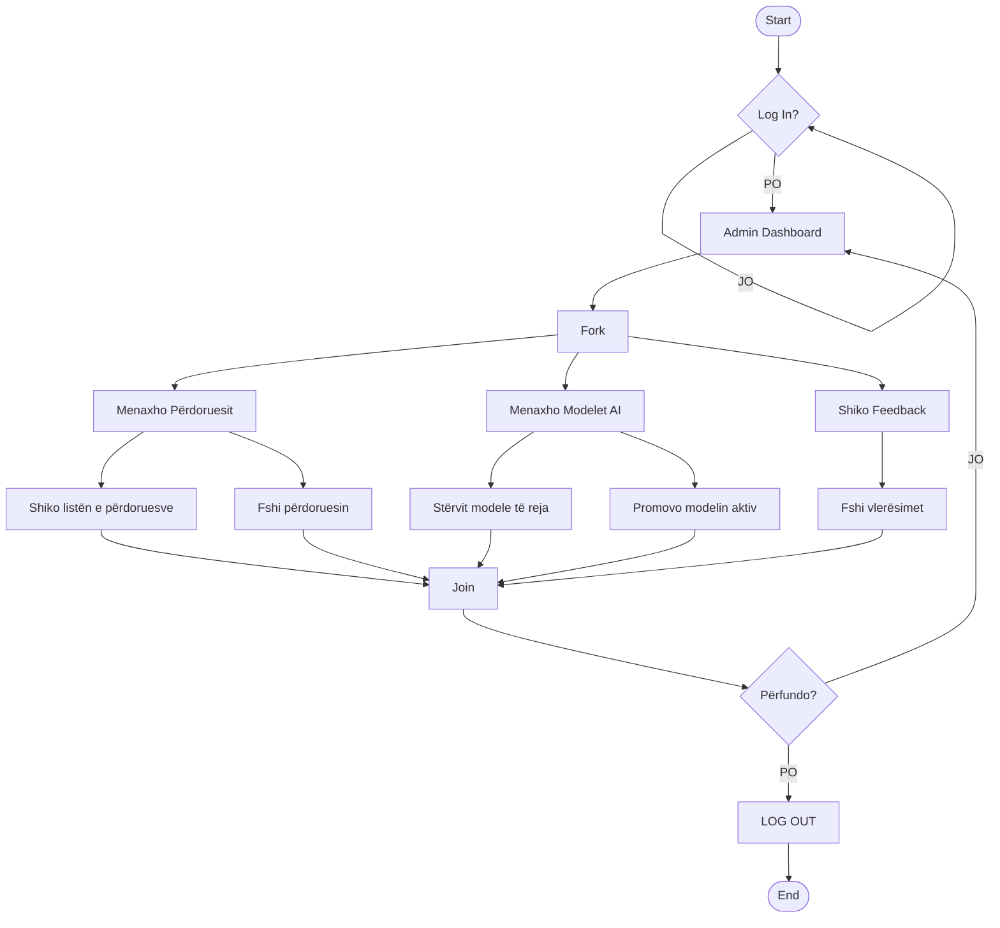
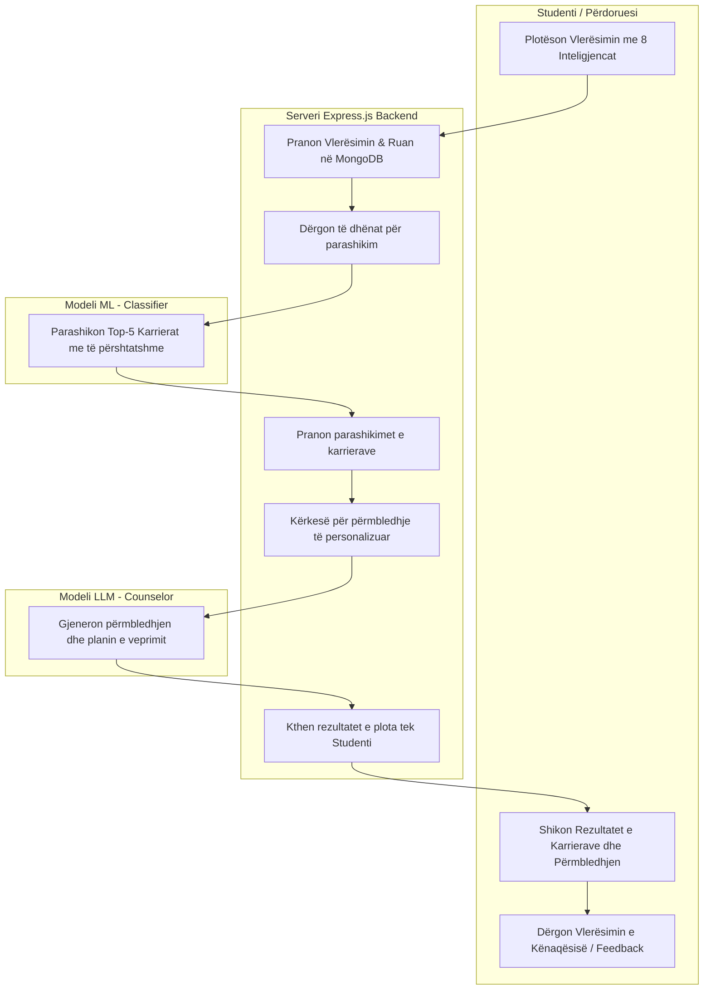
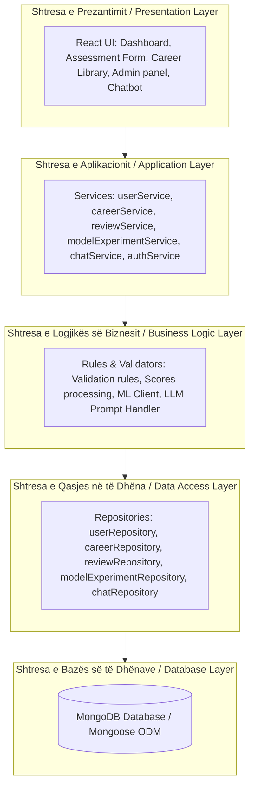

# 📊 Diagramet e Projektit / Project Diagrams

Ky dokument përmban diagramet kryesore të arkitekturës dhe proceseve për projektin **Skill Path Architect / AI Guidance Counselor**. Diagramet janë shkruar në formatin **Mermaid** për t'u shfaqur në mënyrë interaktive.

---

## 1. Diagrami i Aktivitetit - Admin / Activity Diagram - Admin

Ky diagram tregon rrjedhën e punës të administratorit në dashboard-in e administrimit: menaxhimin e përdoruesve, stërvitjen dhe promovimin e modeleve të inteligjencës artificiale (ML), si dhe kontrollin e feedback-ut të studentëve.

---

## 2. Diagrami i Procesit: Vlerësimi deri te Rekomandimi / Process Swimlane: Assessment to Recommendation

Ky diagram tregon ndërveprimin e studentit me serverin Express, modelin e parashikimit ML (XGBoost/SVM) dhe modulin LLM për të gjeneruar këshillimin e personalizuar të karrierës.

---

## 3. Arkitektura e Shtresëzuar / Layered Architecture Diagram

Ky diagram tregon strukturën e shtresëzuar të backend-it të aplikacionit (layered architecture) që ndan përgjegjësitë e kontrollorëve, shërbimeve, repozitorëve dhe bazës së të dhënave.

