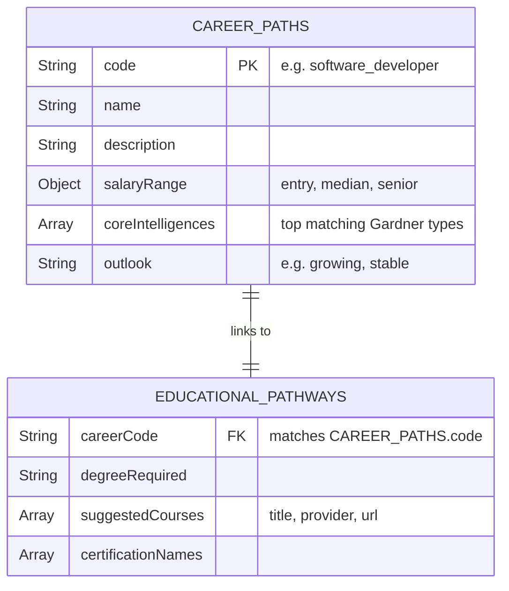
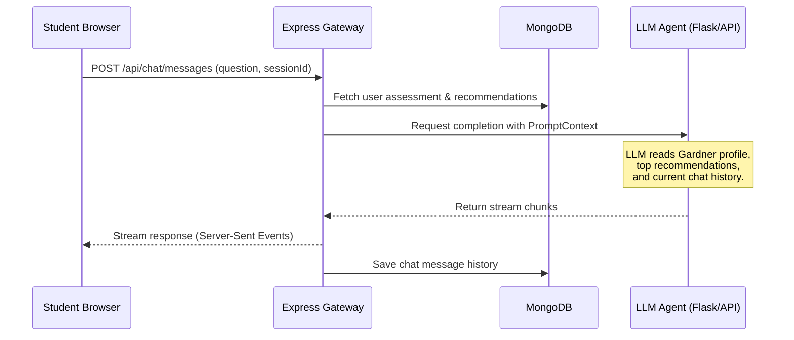

# 🚀 Full-Stack Feature Roadmap & Architecture Specifications

This document outlines the detailed specifications, schema models, sequence workflows, and UI requirements for the next major feature sets of the **Skill-Path Architect** platform.

---

## 🛠️ Table of Contents
1. [Task 1: Dynamic Career Library (`feat/dynamic-career-library`)](#task-1-dynamic-career-library-featdynamic-career-library)
2. [Task 2: Results Loading Experience & Transition Animations (`feat/results-transition-animations`)](#task-2-results-loading-experience--transition-animations-featresults-transition-animations)
3. [Task 3: Interactive Guidance Chatbot (`feat/interactive-counseling-chatbot`)](#task-3-interactive-guidance-chatbot-featinteractive-counseling-chatbot)
4. [Task 4: ML Training & Lifecycle Portal (`feat/ml-training-lifecycle-portal`)](#task-4-ml-training--lifecycle-portal-featml-training-lifecycle-portal)
5. [Task 5: Two-Factor Authentication & Account Recovery (`feat/auth-recovery-2fa`)](#task-5-two-factor-authentication--account-recovery-featauth-recovery-2fa)
6. [Task 6: Profile Section Simplification & Redesign (`feat/profile-simplification`)](#task-6-profile-section-simplification--redesign-featprofile-simplification)
7. [🗄️ Database Collections Schema Guide](#️-database-collections-schema-guide)

---

## Task 1: Dynamic Career Library (`feat/dynamic-career-library`)

Currently, recommendations are parsed without comprehensive background details. This task implements a dynamic career registry serving details, salary bands, and educational requirements from MongoDB based on the 72 classes predicted by the ML model.

### 1. Data Schema
Two new collections will be added: `career_paths` (general profile metadata) and `educational_pathways` (course links, degree suggestions).



### 2. Implementation Flow
1. **Database Seeding (`server/scripts/seed-careers.js`):**
   A JSON seed script mapping all 72 outputs from the ML pipeline to their career data.
2. **REST endpoints:**
   * `GET /api/careers`: Serves the list of careers with search and filtering.
   * `GET /api/careers/:code`: Serves detailed profile information including linked educational resources.
3. **Frontend Integration:**
   Update [AiCareerCard.jsx](file:///c:/Users/Victus/Desktop/Redoni/UBT/Semestri%206/LAB-2/Skill-Path-Architect/frontend/src/components/ai/AiCareerCard.jsx) to fetch details dynamically on click, displaying salaries in a clean dashboard style rather than hardcoded text.

---

## Task 2: Results Loading Experience & Transition Animations (`feat/results-transition-animations`)

Instead of jarring layout changes when moving from assessment submission to the results screen, this task creates a premium, animated transition experience.

### 1. UX Transition Sequence
* **Interactive Assessment Submission:** Clicking "Submit Assessment" triggers a page fadeout.
* **Neural Network Processing Screen:** Displays a loading splash screen with micro-animations:
  * A pulsing network visualization.
  * Progressive progress indicators:
    * `"Calibrating Gardner intelligence metrics..."` (1s)
    * `"Querying career classification network..."` (1s)
    * `"Assembling personalized counselor report..."` (1s)
* **Smooth Page Entry:** The Results page enters using a staggered fade-in animation for layout cards (radar chart slides in from left, career list enters item-by-item from bottom).

### 2. Key Components
* **`TransitionLoader.jsx` (New component):** A full-screen overlay or dedicated view using CSS keyframe animations for gradient rings and status updates.
* **Staggered Animations:** Utilize Tailwind's transitions or simple CSS animations to ease-in container layouts sequentially.

---

## Task 3: Interactive Guidance Chatbot (`feat/interactive-counseling-chatbot`)

Once the student receives their results, they need an immediate way to discuss and refine their options. This feature adds a personal AI career counselor chatbot that is dynamically contextualized by their assessment scores and career suggestions.

### 1. Counseling Dialogue Sequence


### 2. Prompt Context Construction
When a conversation starts, the prompt builder compiles the system context:
```text
System Prompt: You are an empathetic high school career counselor.
Context:
- User Gardner scores: Math (5.0), Spatial (4.5), Collaboration (2.0)
- Model recommended careers: [Data Analyst, Landscape Architect, Statistician]
- Career Metadata: Data Analyst description & salary bands.
User Message: "I don't like desk jobs, why did I get recommended Data Analyst?"
```
This enables the chatbot to explain model outputs in a human-friendly manner.

---

## Task 4: ML Training & Lifecycle Portal (`feat/ml-training-lifecycle-portal`)

To update models or experiment with new classifiers as more assessment data is gathered, this portal exposes the training lifecycle to the admin console.

```
+-------------------------------------------------------------+
|               Admin Model Management Portal                 |
+-------------------------------------------------------------+
|  Algorithm Selector:                                        |
|  [ XGBoost (Active) ] [ Random Forest ] [ Neural Network ]  |
|                                                             |
|  Hyperparameters:                                           |
|  Learning Rate: [ 0.1 ]   Max Depth: [ 6 ]                  |
|                                                             |
|  [ START TRAINING JOB ]                                     |
+-------------------------------------------------------------+
|  Training History & Evaluation Metrics:                     |
|                                                             |
|  Run ID   | Accuracy | Precision | Recall | Deployment      |
|  Run #12  |  98.4%   |   98.2%   | 98.4%  | [ Active ]      |
|  Run #11  |  97.1%   |   96.9%   | 97.2%  | [ Promote ]     |
+-------------------------------------------------------------+
```

### 1. Subprocess Execution
* Trigger `/api/admin/model/train` to launch the Python script in the background.
* Stream validation scores (epoch outputs, confusion matrix files) to the client in real-time.

### 2. Metrics DB Collections
Save metrics (`precision`, `recall`, `f1-score`) per run inside `model_experiments` to display comparison charts to admins, helping them choose the best model version to promote to active status.

---

## Task 5: Two-Factor Authentication & Account Recovery (`feat/auth-recovery-2fa`)

Increases security for user profiles and admin sessions by introducing secure email-based verification tokens and multi-factor authentication.

### 1. Forgot Email / Password Recovery
* **Recovery API:**
  * `POST /api/auth/forgot-email`: Sends a list of associated emails or a lookup notification code to a recovery target.
  * `POST /api/auth/forgot-password`: Generates a temporary link/token sent via email to securely reset access.
* **Email Service Setup:** Integrate Nodemailer in the Express backend, reading credentials securely from `.env` configurations.

### 2. Two-Factor Authentication (2FA) Flow
1. **Verification Generation:** When logging in, the server generates a short-lived, 6-digit OTP code sent via email to the user.
2. **Intermediary Auth State:** The server responds with a temporary `2fa_required` status rather than active JWT tokens.
3. **Verification Input:** The frontend displays an input field for the OTP.
4. **Token Resolution:** The user submits the OTP to `/api/auth/verify-2fa` to receive active access and refresh tokens.

---

## Task 6: Profile Section Simplification & Redesign (`feat/profile-simplification`)

Clean up the profile section by reorganizing the user configuration workspace into a clean, modern dashboard card structure.

### 1. Simplified Layout
* **Unified Workspace:** Replaces bulky forms with a modular design dividing the page into clear segments:
  * **Identity Details:** Simplified form containing Name, Email, and Password update fields.
  * **Security Hub:** Toggle switches to turn Two-Factor Authentication (2FA) on or off.
  * **Activity & Achievements Card:** Visual progress showing completed assessments and saved career benchmarks.
* **Improved UX:** Incorporate micro-interactions (e.g. inline editing saves, smooth toggle transitions, success tooltips).

---

## 🗄️ Database Collections Schema Guide

### 1. `career_paths`
Stores detailed information for the 72 career paths.
```javascript
{
  _id: ObjectId("..."),
  code: "software_engineer",
  name: "Software Engineer",
  description: "Designs, develops, and tests software systems...",
  salaryRange: {
    entry: 65000,
    median: 110000,
    senior: 160000
  },
  coreIntelligences: ["math_and_logic", "spatial_awareness"],
  outlook: "growing"
}
```

### 2. `educational_pathways`
Connects careers with local and international educational paths.
```javascript
{
  _id: ObjectId("..."),
  careerCode: "software_engineer",
  degreeRequired: "Bachelor of Science in Computer Science or Software Engineering",
  suggestedCourses: [
    { title: "CS50: Introduction to Computer Science", provider: "HarvardX", url: "https://..." },
    { title: "MERN Stack Developer Bootcamp", provider: "Coursera", url: "https://..." }
  ],
  certificationNames: ["AWS Certified Developer", "Oracle Certified Professional Java SE"]
}
```

### 3. `chat_sessions`
Manages counseling chats.
```javascript
{
  _id: ObjectId("..."),
  userId: ObjectId("..."),
  title: "Career chat regarding Data Science",
  createdAt: ISODate("2026-06-10T21:40:00Z"),
  lastMessageAt: ISODate("2026-06-10T22:00:00Z")
}
```

### 4. `chat_messages`
Persists the conversation blocks.
```javascript
{
  _id: ObjectId("..."),
  sessionId: ObjectId("..."),
  sender: "assistant", // "user" or "assistant"
  content: "Given your high scores in spatial and math, architecture was selected...",
  timestamp: ISODate("2026-06-10T22:00:00Z")
}
```

### 5. `model_experiments`
Tracks models trained through the admin panel.
```javascript
{
  _id: ObjectId("..."),
  runId: "run_xgboost_12",
  algorithm: "XGBoost",
  hyperparameters: { maxDepth: 6, learningRate: 0.1, nEstimators: 100 },
  accuracy: 0.9833,
  precision: 0.9812,
  recall: 0.9833,
  f1Score: 0.9821,
  metricsPerClass: {
    software_engineer: { precision: 0.99, recall: 0.98, f1: 0.985 },
    graphic_designer: { precision: 0.97, recall: 0.97, f1: 0.97 }
  },
  filePath: "ai/models/archive/career_prediction_model_v12.h5",
  isActive: true,
  createdAt: ISODate("2026-06-10T21:45:00Z")
}
```
